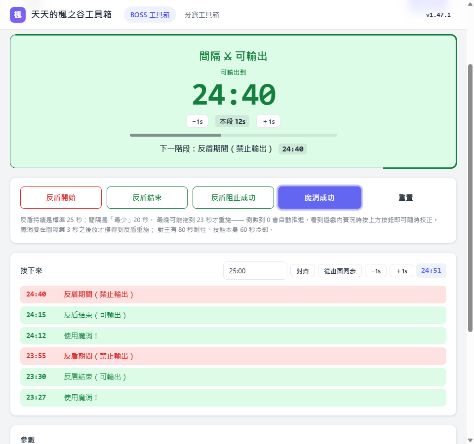
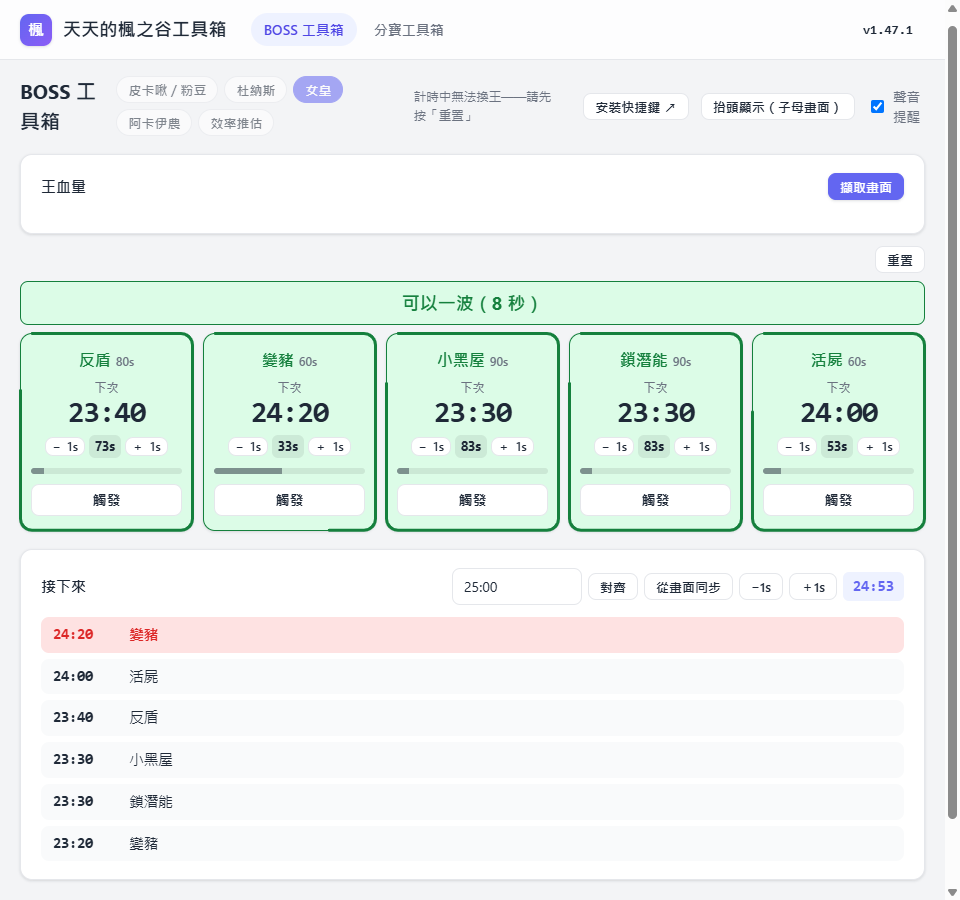
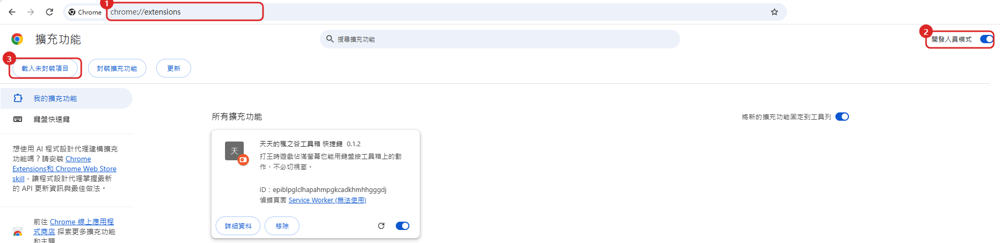

# 天天的楓之谷工具箱

打王用的計時與提醒：反盾王的階段倒數與魔消時機、女皇五個機制的循環與「一波」判斷、阿卡伊農的血量門檻。
能直接讀螢幕上的王血量與遊戲計時，能開成浮在遊戲上面的抬頭顯示，裝個小擴充套件就能在遊戲裡用快捷鍵按。

**網址：<https://unrealsky.github.io/maplestory-toolkit/>**

每隻王有自己的網址（例如 `…/#/boss-toolkit/cygnus`），可以直接貼給隊友。計時中換不了王，先按「重置」。
所有設定都存在你這台電腦的這個瀏覽器裡，不會上傳。

---

## 皮卡啾／粉豆、杜納斯（反盾）

倒數到 0 會自動推進下一段，看到遊戲實況再按按鈕校正就好。對齊遊戲計時後，「可輸出到」直接顯示遊戲時間。

- **反盾阻止成功**：隨時可按，直接進入「反盾被阻止」的可輸出期。
- **魔消成功**：可以魔消的時候這顆按鈕會一直脈動、面板內框跟著呼吸，按下去或階段換了就停。
  太早放會閃黃三下——反盾重施前就失效了，擋不到。王有 80 秒耐性、技能 60 秒冷卻，面板會提醒。

**接下來**列出往後幾輪的反盾期間、反盾結束、該用魔消的時刻。
**參數**裡每隻王的反盾持續、間隔、浮動都能改，改回預設會自動移除覆寫；魔消持續是你的技能，換王不變。

## 女皇（循環）

反盾 80、變豬 60、小黑屋 90、鎖潛能 90、活屍 60 秒一輪。看到機制出現按那張卡的「觸發」，之後自動接下一輪；`−1s`／`＋1s` 只動那一個機制。

### 一波

女皇低於 11% 會回血到 50%，靠魔消 20 秒擋住回血全力打完。魔消期間變豬、小黑屋、鎖潛能照樣會斷輸出（反盾放了無效、活屍不影響），所以最上面那一條看的是這三個時鐘：

- 綠底「**可以一波（N 秒）**」：N 是還有多少時間可以開始。最後 25 秒（魔消 20 ＋ 喊、反應、施放 5 秒）是魔消要用的，掉到 0 翻黃。
- 黃底「**等 N 秒後可以一波**」，第二行是在等哪幾個機制觸發。
- 「**等待 變豬、小黑屋 觸發**」：那幾個時鐘還沒按過，沒依據不亂說可以。

## 阿卡伊農（血量門檻）與效率推估

阿卡伊農在 80／60／40／20% 各出一次招，20% 以下改成每 70 秒一輪。要開「王血量」擷取才讀得到血量，快到門檻先提醒、跨過去再確認一次。
效率推估沒有機制，只有血條與 DPS。

## 王血量

「擷取畫面」選遊戲視窗後自動找血條讀百分比，找不到就「框選血條」指定範圍。
血條旁是從畫面裁下來的王頭像；換王或換階段時上一條凍住放上面留 10 秒對照。右邊是 60 秒最高與整場最高的每秒傷害。

## 遊戲計時

「接下來」右側輸入遊戲剩餘時間按「對齊」，之後所有時刻都用遊戲時間顯示；有開擷取畫面可以「從畫面同步」直接讀。

## 抬頭顯示（子母畫面）

面板另開一個永遠置頂的小視窗浮在遊戲上面：遊戲計時、王血量（連頭像一起從畫面裁下來）、階段倒數、操作按鈕都在裡面，主視窗那份照樣留著，兩邊是同一份狀態。只有 Chromium 系列（Chrome、Edge）支援。

## 全域快捷鍵（選用）

打王時遊戲佔滿螢幕，要按面板得先切視窗。網頁只有在自己有焦點時才收得到鍵盤，所以得靠一個小小的 Chrome 擴充套件代收。不裝也沒關係，畫面跟以前完全一樣。

### 六個格子

第 N 格永遠是「**目前這隻王面板上第 N 個動作**」，換王不必重綁：

| 格 | 皮卡啾／粉豆、杜納斯 | 女皇 |
|---|---|---|
| 1 | 反盾開始 | 反盾 |
| 2 | 反盾結束 | 變豬 |
| 3 | 反盾阻止成功 | 小黑屋 |
| 4 | 魔消成功 | 鎖潛能 |
| 5 | （沒有） | 活屍 |

「重置」刻意不給快捷鍵，誤按會把整場計時清掉。阿卡伊農與效率推估打王時沒有要按的按鈕。

### 安裝

1. 下載 [maplestory-toolkit-hotkeys.zip](https://github.com/UnRealSKY/maplestory-toolkit/releases/latest/download/maplestory-toolkit-hotkeys.zip) 並解壓縮。工具箱標題列的「安裝快捷鍵」連的就是這個檔，永遠是最新版。
2. 網址列輸入 `chrome://extensions`，右上角打開**開發人員模式**（1），按**載入未封裝項目**（2），選解壓出來的 `maplestory-toolkit-hotkeys` 資料夾。

   

3. 網址列輸入 `chrome://extensions/shortcuts`，把「第 1 格」到「第 5 格」各綁一個鍵，每一格右邊的範圍要選 **全域**——不選全域的話 Chrome 沒焦點時收不到。
4. 回到工具箱重新整理，按鈕角落會標出各自的鍵；還沒綁的格子顯示「未綁 N」，標題列的「設定快捷鍵」直接帶你去設定頁。

之後有新版：重新下載、解壓到同一個資料夾覆蓋，`chrome://extensions` 按那張卡的**重新載入**，然後**重新整理工具箱頁面**。綁好的鍵不會跑掉。

> Chrome 規定快捷鍵**必須含 `Ctrl` 或 `Alt`**（`Shift` 可加可不加），純 F 鍵或單一字母綁不上去。
> 楓之谷預設 `Ctrl` 是攻擊、`Alt` 是跳躍，綁之前想一下會不會誤觸。

## 分寶工具箱

把 Discord 上的分寶紀錄貼進來、表單編輯、自動算每個人該拿多少、掉落物均分、一鍵複製回 Discord 或直接發佈到論壇頻道，未領總覽一頁看完誰還沒領。

完整說明見 **[docs/loot-toolkit.md](docs/loot-toolkit.md)**。
